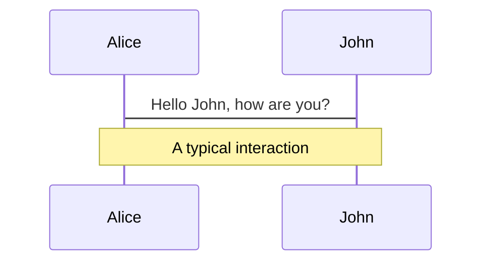
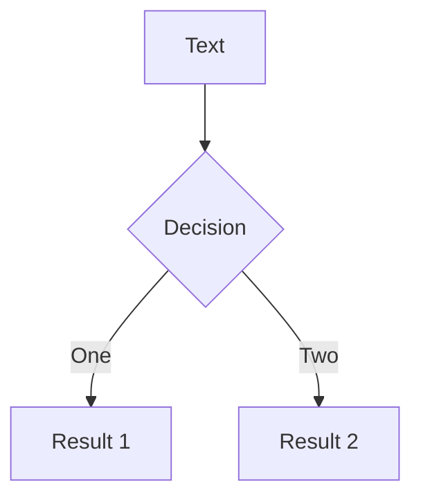
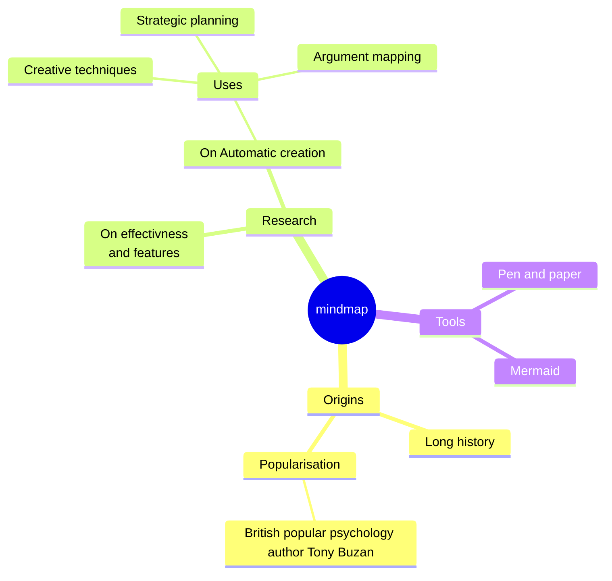
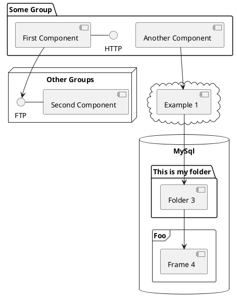

  <div class="absolute h-full w-full bg-white"></div>
  <div class="absolute pt-6 left-12">
    <span @click="next" class="p-1 rounded cursor-pointer hover:bg-white hover:bg-opacity-10 hover:opacity-90 opacity-60 flex justify-center items-center">
      Press Space for next page  <light-icon icon="arrow-narrow-right" size="24px"/>
    </span>
  </div>

  <div class="isolate grid place-items-center h-full z-1">
    <div>
      <div class="text-5xl/normal text-black" style="font-weight:600;" >
        ECテーマをつかって <br /> 一覧からカートに追加するボタンを <br /> 実装してみよう！
      </div>
      <span class="text-xl text-primary-lighter" style="font-weight:500;" >
        Nov. 17, 2023 a-blog cms Training Camp 2023 <light-icon class="font-bold" icon="rocket"/>
      </span>
    </div>
  </div>


---
layout: self-intro
title: 自己紹介
image: '/profile.jpg'
---

# 宇井 陸登

有限会社アップルップル<br />
フロントエンドエンジニア

a-blog cmsの開発や、a-blog cms でECを構築するための拡張アプリ、テーマの開発業務を担当しています。

---
layout: center-image
title: 一覧からカートに追加するイメージ
image: '/add-to-cart.svg'
---
  <div class="mb-4">
    <span class="text-4xl text-black font-bold" >
      商品一覧ページから、カートに商品を追加できる
     <light-icon icon="shopping-cart" />
    </span>
  </div>

---
layout: center-image
title: コンバージョン率が向上するイメージ
image: '/data-reports.svg'
---
  <div class="mb-4">
    <span class="text-4xl text-black font-bold" >
      ユーザビリティ及び、コンバージョン率の向上
     <light-icon icon="chart-line" />
    </span>
  </div>

---
layout: section-title
title: デザイナーさん、ディレクターさん向けではないことをお知らせ
---

# エンジニアさん向けの内容です

---
layout: section-title
title: ECテーマについて
---

<h1 class="font-bold">ECテーマについて 🛒</h1>

---
layout: heading-and-body
title: 拡張アプリ「ShoppingCart」を実装したテーマ
---
<template #heading>
<h1>拡張アプリ「ShoppingCart」を実装したテーマ</h1>
</template>

<template #body>

<div class="mt-20 text-3xl">

- ショッピングカート機能
- 決済フォーム機能
- Squareと連携したオンライン決済機能

</div>

</template>

---
layout: section-title
title: HTMLとCSSのカスタマイズで見た目を整えればECサイトを納品できる
class: text-center
---

<h1 class="font-bold">HTMLとCSSのカスタマイズで <br />見た目を整えれば<br />ECサイトを納品できる</h1>

---
layout: heading-and-body
title: 料金について
---
<template #heading>
<h1>料金について</h1>
</template>

<template #body>

<div class="mt-20 text-3xl">

- ECテーマと 拡張アプリ「ShoppingCart」は無料 🎊
- a-blog cms のライセンス料金だけでECサイトを公開できる

</div>

</template>

---
layout: image-left
image: /how-to-download.png
equal: true
title: ダウンロード
---

<div class="text-center">
  <h1 class="font-medium leading-relaxed">
  <a href="https://developer.a-blogcms.jp/document/ec-cart/Install.html" target="_blank" rel="noopener noreferrer">
    ダウンロード <light-icon icon="download" size="48px"/>
  </a>
  </h1>
</div>

---
layout: image-left
image: /demo-site.png
equal: true
title: デモサイト
---

<div class="text-center">
  <h1 class="font-medium leading-relaxed">
  <a href="https://appleple.shop" target="_blank" rel="noopener noreferrer">
    DEMO
  </a>
  </h1>
</div>

---
layout: dynamic-image
image: '/add-to-cart-in-detail-page.png'
equal: true
left: true
title: 商品詳細ページからカートへ追加ができる
---

<h1 class="font-bold">商品詳細ページから<br/>カートへ追加ができる</h1>


---
layout: dynamic-image-with-body
image: '/web-shopping.svg'
equal: false
left: false
title: 一覧からカートに追加できない問題
---

<template #heading>
<h1 class="!text-3xl">一覧からカートに追加できない問題</h1>
</template>

<template #body>

<div class="mt-20 text-2xl">

- 毎回カートに商品を追加するために詳細ページに遷移するのが手間
- ユーザーの購入意欲減少の原因

</div>

</template>

---
layout: section-title
title: 🤦
---

<div class="grid place-content-center h-full">
  <span class="text-8xl">🤦</span>
</div>

---
layout: section-title
title: ECサイトの商品一覧ページから、カートに商品を追加できれば解決
class: text-center
---

<h1 class="font-bold">商品一覧ページから、<br />カートに追加できれば解決🥹</h1>

---
layout: section-title
title: 実装方法紹介します！
class: text-center
---

<h1 class="font-bold">実装方法紹介します🙌</h1>

---
layout: section-title
title: 完成品デモ
class: text-center
---

<h1 class="font-bold">完成品デモ</h1>

<!-- 動画でデモしたいかも -->

---
layout: section-title
title: 仕組みの解説
class: text-center
---

<h1 class="font-bold">仕組みの解説</h1>

---
layout: dynamic-image-with-body
image: 'https://source.unsplash.com/collection/94734566/1920x1080'
equal: true
left: false
title: ShoppingCart_AddItem
---


<template #heading>
<h1 class="!text-4xl">ShoppingCart_AddItem</h1>
</template>

<template #body>

<div class="mt-20 text-xl">

- カートに商品を追加するためのPOSTモジュール
- 商品のエントリーIDと、数量を指定してフォームを送信（POST）する

</div>

</template>

---
layout: dynamic-image
image: '/network.png'
upperImage: '/expanded-network.png'
equal: true
left: false
title: 開発者ツールから実際の通信を確認してみる
---

<h1 class="font-bold">
  開発者ツールから<br />実際の通信を確認🔍
</h1>

---
layout: dynamic-image-with-body
image: 'parker-coffman-rg60lmL4AUs-unsplash.jpg'
equal: false
left: false
title: 「カートに入れる」ボタン
---


<template #heading>
<h1 class="!text-4xl">「カートに入れる」ボタン</h1>
</template>

<template #body>

<div class="mt-20 text-xl">

```html
<!-- include/entry/body-products.html -->

<div class="js-shopping-cart">
  <add-to-cart
    :eid="{entry:loop.eid}"
    <!-- BEGIN_IF [{item_stock}/isset] -->
    :stock="{item_stock}"
    <!-- ELSE -->
    :stock="null"
    <!-- END_IF -->
  ></add-to-cart>
</div>
```

</div>

</template>

---
layout: image-right
image: /vue.svg
equal: true
title: Vue.js
---

<div>
  <h1 class="text-black" >Vue.js</h1>
</div>
<div class="leading-snug text-black dark:text-white text-opacity-60 dark:text-opacity-60">
  JavaScriptのライブラリです。
  <br/><br/>
  ユーザービリティの高いUIが構築できる！
</div>

---
layout: section-title
title: 安心してください
class: text-center
---

<h1 class="font-bold">安心してください🍵</h1>

---
layout: center-image
title: HTMLとCSSでカスタマイズできます
image: '/static-website.svg'
class: text-center
---

<h1 class="font-bold text-4xl mb-4">HTMLとCSSでカスタマイズできます</h1>

---
layout: heading-and-body
title: <add-to-cart></add-to-cart>の説明
---

<template #heading>
<h1 class="!text-3xl">

  `<add-to-cart></add-to-cart>`

</h1>
</template>

<template #body>

<div class="mt-20 text-2xl">

`<add-to-cart :eid="{eid}" :stock="{stock}"></add-to-cart>` が include/vue-template/add-to-cart.html で定義されているHTMLに置き換わる

`:eid` 属性に指定されたエントリーIDが次の input 要素を生成

```html
<!-- 例えば :eidが42の場合 -->
<input type="hidden" name="eid" value="42">
<input type="hidden" name="cart[]" value="eid">
```

このフォームで、ShoppingCart_AddItem モジュールを実行すると、エントリーIDが42の商品が、カートに追加される

</div>

</template>

---
layout: section-title
title: Entry_Summary の場合、entry:loop で {eid} を :eid 属性に指定すれば良い🤔
class: text-center
---

<h1 class="font-bold !text-4xl">
Entry_Summary の場合、<br />entry:loop で {eid} を <code>:eid</code> 属性に指定すれば良い🤔
</h1>

```html
<!-- BEGIN entry:loop -->
...
<div class="js-shopping-cart">
  <add-to-cart
    :eid="{eid}"
    <!-- BEGIN_IF [{item_stock}/isset] -->
    :stock="{item_stock}"
    <!-- ELSE -->
    :stock="null"
    <!-- END_IF -->
  ></add-to-cart>
</div>
...
<!-- END entry:loop -->
```

---
layout: section-title
title: 動画でできなかった場合のデモ
class: text-center
---

# 動画でできなかった場合のデモを見せたい

---
layout: heading-and-body
title: 「カートに入れる」ボタン毎に異なる表示をしたい部分がうまく制御できていません。
---
<template #heading>
<h1 class="!text-3xl">
「カートに入れる」ボタン毎に表示を変えたい部分ができていない
</h1>
</template>

<template #body>

<div class="mt-20 text-2xl">

- 色とサイズのフォーム項目
- カートへの商品の追加が成功したときに表示されるモーダル内の画像

</div>

</template>

---
layout: bubble-frame-only
title: つまり…
class: px-20
---

<h1 class="font-bold">つまり</h1>

<div grid="~ cols-2 gap-2" class="mt-16">

<h2 class="font-bold">できる🙆</h2>

<h2 class="font-bold">できない🙅</h2>


</div>


---
layout: section-title
title: まとめ
class: text-center font-bold
---

# まとめ

---
layout: section-title
title: ECテーマなら、HTMLとCSSとちょっとの Vue の知識で、一覧からカートに商品を追加するボタンの実装ができる
class: text-center font-bold
---

<h1 class="!text-3xl !leading-10">ECテーマなら、<br />HTMLとCSSとちょっとの Vue の知識で、<br />一覧からカートに商品を追加するボタンの実装ができる👏</h1>

---
layout: cover
title: a-blog cms Ver. 3.1 に対応したバージョンをリリース
background: '/release-new-version.png'
class: text-center
---

<h1 class="!text-5xl">Ver. 3.1 対応のバージョンをリリース</h1>

---
layout: section-title
title: ご清聴ありがとうございました
class: text-center font-bold
---

# ご清聴ありがとうございました🙇

---
class: px-20
---

# Themes

Slidev comes with powerful theming support. Themes can provide styles, layouts, components, or even configurations for tools. Switching between themes by just **one edit** in your frontmatter:

<div grid="~ cols-2 gap-2" m="-t-2">

```yaml
---
theme: default
---
```

```yaml
---
theme: seriph
---
```


</div>

Read more about [How to use a theme](https://sli.dev/themes/use.html) and
check out the [Awesome Themes Gallery](https://sli.dev/themes/gallery.html).

---
preload: false
---

# Animations

Animations are powered by [@vueuse/motion](https://motion.vueuse.org/).

```html
<div
  v-motion
  :initial="{ x: -80 }"
  :enter="{ x: 0 }">
  Slidev
</div>
```

<div class="w-60 relative mt-6">
  <div class="relative w-40 h-40">
    
    
    
  </div>

  <div
    class="text-5xl absolute top-14 left-40 text-[#2B90B6] -z-1"
    v-motion
    :initial="{ x: -80, opacity: 0}"
    :enter="{ x: 0, opacity: 1, transition: { delay: 2000, duration: 1000 } }">
    Slidev
  </div>
</div>

<!-- vue script setup scripts can be directly used in markdown, and will only affects current page -->
<script setup lang="ts">
const final = {
  x: 0,
  y: 0,
  rotate: 0,
  scale: 1,
  transition: {
    type: 'spring',
    damping: 10,
    stiffness: 20,
    mass: 2
  }
}
</script>

<div
  v-motion
  :initial="{ x:35, y: 40, opacity: 0}"
  :enter="{ y: 0, opacity: 1, transition: { delay: 3500 } }">

[Learn More](https://sli.dev/guide/animations.html#motion)

</div>

---

# LaTeX

LaTeX is supported out-of-box powered by [KaTeX](https://katex.org/).

<br>

Inline $\sqrt{3x-1}+(1+x)^2$

Block
$$ {1|3|all}
\begin{array}{c}

\nabla \times \vec{\mathbf{B}} -\, \frac1c\, \frac{\partial\vec{\mathbf{E}}}{\partial t} &
= \frac{4\pi}{c}\vec{\mathbf{j}}    \nabla \cdot \vec{\mathbf{E}} & = 4 \pi \rho \\

\nabla \times \vec{\mathbf{E}}\, +\, \frac1c\, \frac{\partial\vec{\mathbf{B}}}{\partial t} & = \vec{\mathbf{0}} \\

\nabla \cdot \vec{\mathbf{B}} & = 0

\end{array}
$$

<br>

[Learn more](https://sli.dev/guide/syntax#latex)

---

# Diagrams

You can create diagrams / graphs from textual descriptions, directly in your Markdown.

<div class="grid grid-cols-4 gap-5 pt-4 -mb-6">









</div>

[Learn More](https://sli.dev/guide/syntax.html#diagrams)

---
src: ./pages/multiple-entries.md
hide: false
---

---
layout: center
class: text-center
---

# Learn More

[Documentations](https://sli.dev) · [GitHub](https://github.com/slidevjs/slidev) · [Showcases](https://sli.dev/showcases.html)
